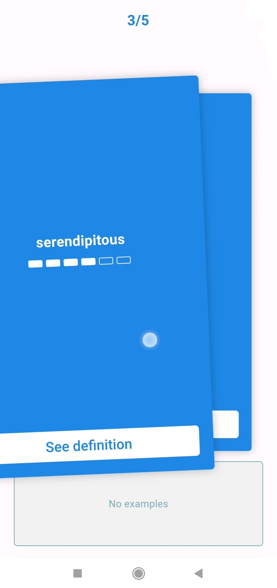
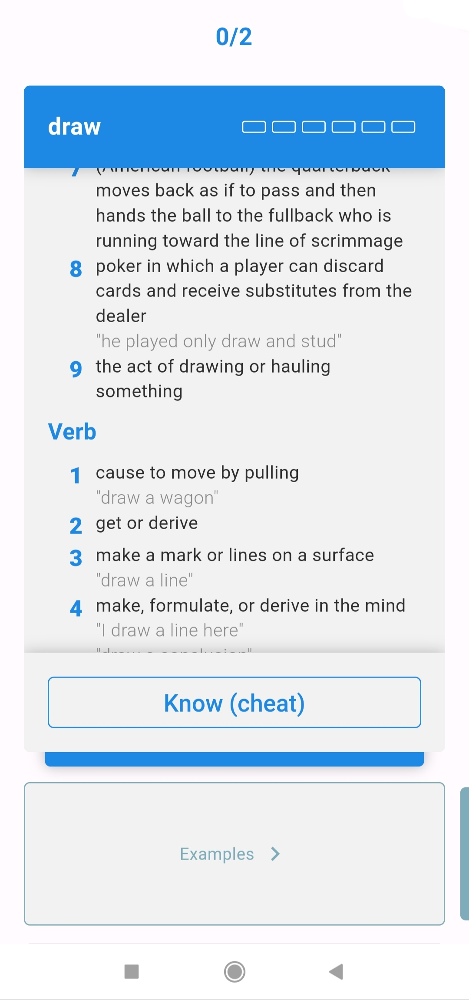

# voca

Memorize new words with spaced repetition

---
<p float="left">
  
   
</p>

---


## Features
- Search for a word, check its definition, and add it to the Learning list.
- Those words then show up on cards when you go to Practice. 
- Swipe the card if you remember the word, or tap See the Definition (flip the card) if you don't.
- If you remember the word, it will show up after a longer interval next time.
- If you don't, the progress is reset.
---
- If you come across a new word elsewhere, select the text and tap the three dots - you will be able
to add the word to the app in a quicker way.

## Project status
It works but lots of improvements & features are on the way. 
Bug reports & feature requests are welcome.

## Contributing
It's pretty tricky...

**Initialize project**
```
flutter packages pub get
flutter pub run slang
flutter pub run build_runner build --delete-conflicting-outputs
```
**Configure firebase**

Unfortunately, you will need to use your own api key.
1. Fill in the blanks in `environments/template.json`
2. Put the google-services.json file in `android/app/src/development`
3. `flutter run --flavor development --dart-define-from-file=./environments/dev.json` (or similarly for production)

OR

You can try to just remove the firebase initialization in `main.dart`. I only use crashlytics currently, so it should still work.

## Tests

**Unit tests**

Run this once before testing:
```
test/scripts/update_test_db.sh 
```

**Integration tests**

```
scripts/run_integration.sh [specific_test.dart]
```


## Sources
Wordnet: https://wordnet.princeton.edu/
